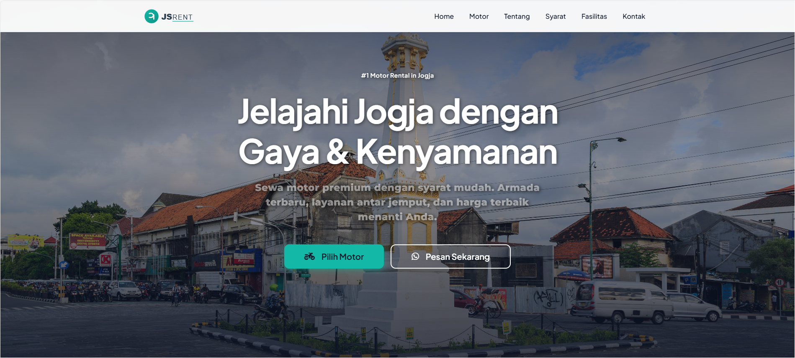
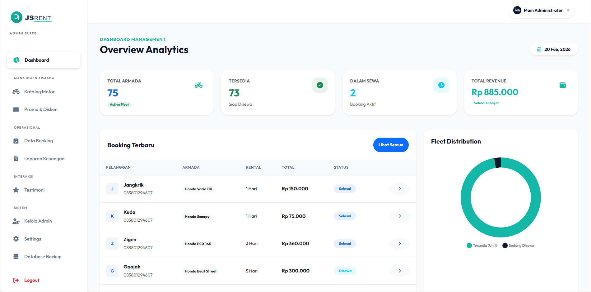

# 🏍️ JS RENT - Sistem Informasi Rental Motor


**JS RENT** adalah aplikasi web manajemen rental motor yang dibangun menggunakan PHP Native. Sistem ini dirancang untuk mempermudah proses peminjaman, pengembalian, dan manajemen stok motor secara efisien. Website ini juga mendukung fitur **PWA (Progressive Web App)** sehingga dapat diinstal layaknya aplikasi native di perangkat mobile.

---

## 📸 Tampilan Aplikasi

| Halaman Utama | Dashboard Admin |
|:---:|:---:|
|  |  |
*(Ganti dengan screenshot asli project Anda)*

---

## 🚀 Fitur Unggulan

- **Manajemen Booking**: Booking motor secara online dengan pemilihan tanggal real-time.
- **Payment Gateway**: Terintegrasi dengan Midtrans untuk pembayaran otomatis.
- **PWA Ready**: Dapat diinstal di Android/iOS dan berjalan offline (sebagian fitur).
- **Laporan Otomatis**: Generate laporan harian/bulanan dengan mudah.
- **Manajemen User & Admin**: Hak akses berbeda untuk admin dan pelanggan.
- **Backup Database**: Fitur backup database otomatis dan manual.
- **Notifikasi Email**: Konfirmasi booking melalui email (PHPMailer).

---

## 🛠️ Teknologi yang Digunakan

Project ini dibangun dengan teknologi berikut:

- **Backend**: PHP Native (No Framework)
- **Database**: MySQL (MariaDB)
- **Frontend**: HTML5, CSS3, JavaScript (Vanilla)
- **Styling**: Bootstrap 5 (atau framework CSS yang digunakan), Custom CSS
- **Tools**: XAMPP (Apache Server)
- **Library**:
  - [Midtrans](https://midtrans.com/) (Payment Gateway)
  - [PHPMailer](https://github.com/PHPMailer/PHPMailer) (Email Sender)
  - [SweetAlert2](https://sweetalert2.github.io/) (Alerts)

---

## 📂 Struktur Folder

Berikut adalah struktur direktori utama pada project ini:

```bash
/Rental-Motor
├── admin/          # Halaman dashboard administrator
├── ajax/           # Handler request AJAX
├── assets/         # File statis (CSS, JS, Images)
├── backups/        # Backup database & sistem
│   └── db/         # Kumpulan file .sql database
├── config/         # Konfigurasi database & API
├── includes/       # Library & Helper functions
├── uploads/        # Folder penyimpanan gambar motor/user
├── index.php       # Landing page utama
├── sw.js           # Service Worker (PWA)
└── manifest.json   # Konfigurasi PWA
```

---

## 💻 Cara Instalasi & Menjalankan

Ikuti langkah-langkah berikut untuk menjalankan project di lokal (XAMPP):

### 1. Persiapan Environment
Pastikan Anda telah menginstal **XAMPP** dengan PHP versi 7.4 atau lebih tinggi.

### 2. Clone Repository
Clone atau download project ini ke dalam folder `htdocs`.
```bash
cd C:\xampp\htdocs
git clone https://github.com/username/JS-RENT.git
```
*(Atau ekstrak file ZIP jika di-download manual)*

### 3. Konfigurasi Database
1. Buka **phpMyAdmin** (`http://localhost/phpmyadmin`).
2. Buat database baru dengan nama: `rental_motor`.
3. Import file database:
   - Buka tab **Import**.
   - Pilih file `.sql` terbaru dari folder: `backups/db/` (pilih file dengan tanggal terbaru).
   - Klik **Go**.

### 4. Konfigurasi Koneksi
Buka file `config/database.php` dan sesuaikan dengan settingan XAMPP Anda (jika default, biarkan saja):
```php
$host = 'localhost';
$db   = 'rental_motor';
$user = 'root';
$pass = ''; // Password default XAMPP biasanya kosong
```

### 5. Jalankan Project
Buka browser dan akses alamat berikut:
```
http://localhost/Rental-Motor
```

---

## 👤 Akun Default (Demo)

Jika menggunakan database bawaan, berikut adalah akun default untuk login:

**Administrator:**
- Username: `admin`
- Password: `password` (atau cek tabel `users`)

**User / Pelanggan:**
- Silakan registrasi akun baru di halaman utama.

---

## 🤝 Kontribusi

Kontribusi selalu terbuka! Jika Anda ingin meningkatkan project ini, silakan:
1. Fork repository ini.
2. Buat branch fitur baru (`git checkout -b fitur-baru`).
3. Commit perubahan Anda (`git commit -m 'Menambahkan fitur keren'`).
4. Push ke branch (`git push origin fitur-baru`).
5. Buat Pull Request.

---

## 📝 Author

**Alfi Dias Saputra**
- GitHub: [@alfidias](https://github.com/alfidias)
- Email: alfidias1511@gmail.com

---

Managed with ❤️ by [Alfye]

